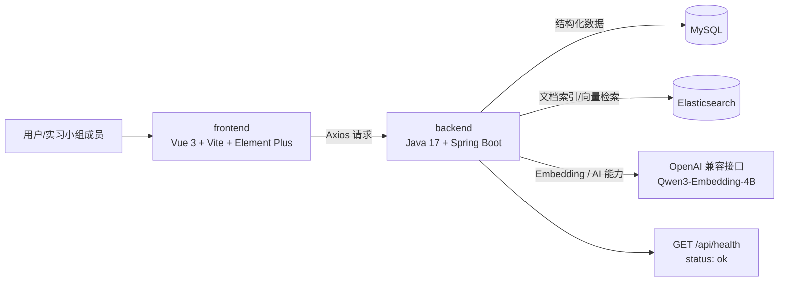
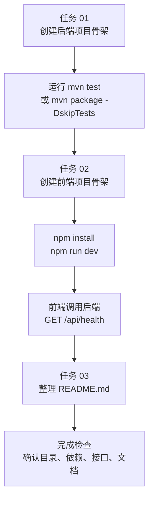
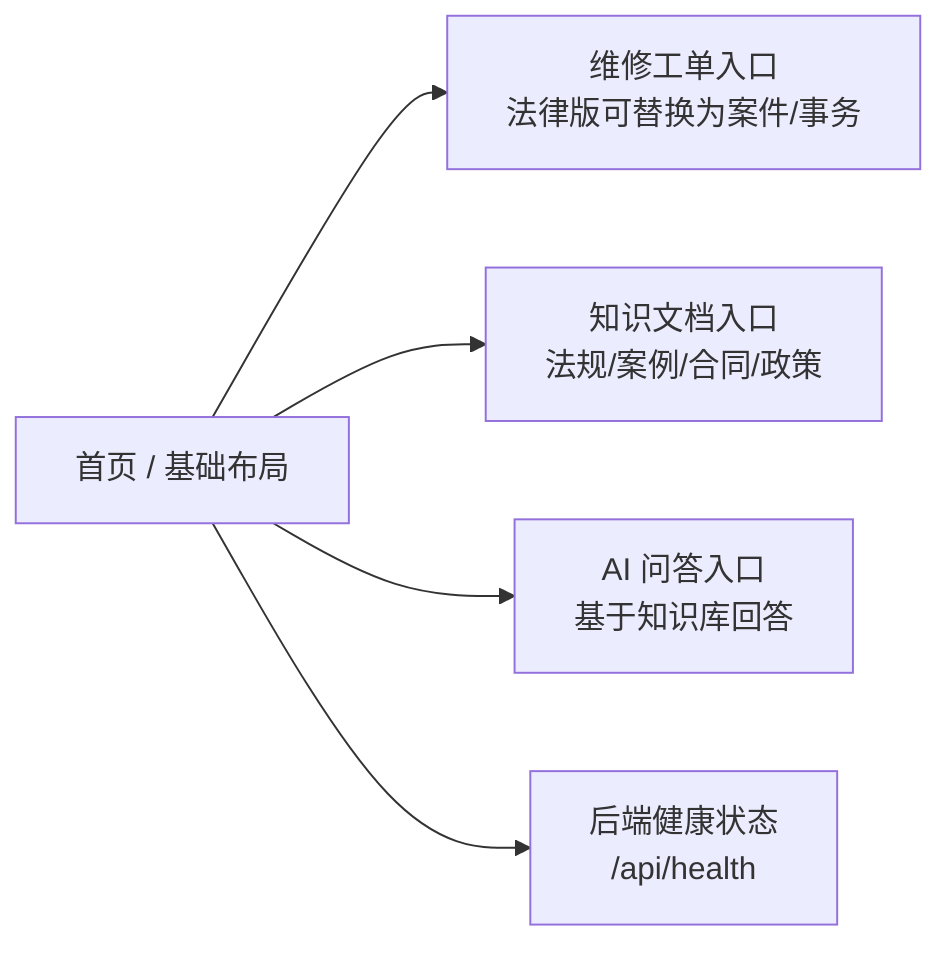
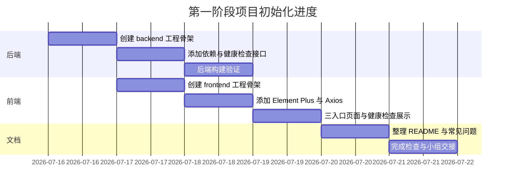
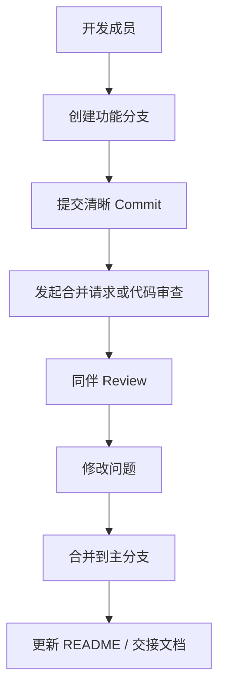

# AI RAG 知识库项目前后端初始化计划书

## 1. 项目概述

本项目是一个 AI RAG 知识库实训项目，第一阶段目标是完成前后端基础工程搭建，为后续知识检索、文档管理、向量索引和 AI 问答功能打基础。

课程文件中的业务场景是“EOS 维修工单和企业维修文档知识库”。结合当前实习方向，项目也可以平滑迁移为“法律知识库”场景，例如法律法规、案例文书、合同条款、合规问答等内容检索与问答。

本阶段只搭建项目骨架，不实现复杂业务功能。

## 2. 建设目标

| 目标 | 说明 | 交付物 |
|---|---|---|
| 后端工程初始化 | 使用 Java 17 + Spring Boot 搭建后端项目 | `backend/` |
| 前端工程初始化 | 使用 Vue 3 + Vite 搭建前端项目 | `frontend/` |
| 健康检查联调 | 前端访问后端 `GET /api/health` | 页面展示后端状态 |
| 项目说明文档 | 整理启动方式、版本要求、常见问题 | `README.md` |
| 后续扩展准备 | 预留 RAG、数据库、向量检索相关依赖和目录 | 基础包结构与依赖 |

## 3. 技术栈规划

| 层级 | 技术 | 用途 |
|---|---|---|
| 后端语言 | Java 17 | 后端主开发语言 |
| 后端框架 | Spring Boot | REST API 与服务层开发 |
| AI 集成 | Spring AI OpenAI Starter | 对接 OpenAI 兼容接口 |
| ORM | MyBatis-Plus | 数据库访问 |
| 数据库 | MySQL | 结构化业务数据存储 |
| 向量检索 | Elasticsearch Java Client | 文档索引与向量检索准备 |
| 前端框架 | Vue 3 | 前端页面开发 |
| 构建工具 | Vite | 前端开发与构建 |
| UI 组件 | Element Plus | 快速搭建管理类界面 |
| HTTP 请求 | Axios | 前端统一请求封装 |
| Embedding 模型 | `Qwen/Qwen3-Embedding-4B` | 文档向量化准备 |

## 4. 总体架构



## 5. 项目目录规划

```text
proj1/
├─ backend/
│  ├─ pom.xml
│  └─ src/main/java/...
│     ├─ controller/
│     ├─ service/
│     ├─ mapper/
│     ├─ entity/
│     ├─ dto/
│     ├─ vo/
│     └─ config/
├─ frontend/
│  ├─ package.json
│  ├─ vite.config.*
│  └─ src/
│     ├─ api/
│     ├─ views/
│     ├─ components/
│     └─ router/
├─ README.md
└─ docs/
   └─ project-plan.md
```

## 6. 阶段任务拆解



### 任务 01：后端项目骨架

建设内容：

- 在根目录新建 `backend/`。
- 创建 Maven 项目，项目名为 `rag-kb-demo`。
- 使用 Java 17 和 Spring Boot。
- 添加基础依赖：Spring Web、Validation、MyBatis-Plus、MySQL Driver、Spring AI OpenAI Starter、Elasticsearch Java Client、Lombok。
- 预留 `controller`、`service`、`mapper`、`entity`、`dto`、`vo`、`config` 包。
- 新增健康检查接口：`GET /api/health`。
- 接口返回：`{"status":"ok"}`。

验收方式：

```bash
mvn test
```

或：

```bash
mvn package -DskipTests
```

### 任务 02：前端项目骨架

建设内容：

- 在根目录新建 `frontend/`。
- 创建 Vue 3 + Vite 项目，项目名为 `rag-kb-web`。
- 引入 Element Plus 和 Axios。
- 封装统一 HTTP 请求。
- 页面准备三个入口：
  - 维修工单 / 后续可替换为法律事务或案件资料
  - 知识文档 / 后续可承载法规、案例、合同、政策文件
  - AI 问答 / 后续用于基于知识库的智能问答
- 首页或基础布局显示后端健康检查结果。
- 默认接口地址：`http://localhost:8080`。
- 后端不可用时显示：`后端服务未连接`。

验收方式：

```bash
npm install
npm run dev
```

### 任务 03：README 文档

README 需要包含：

- 项目简介。
- 后端启动方式。
- 前端启动方式。
- JDK、Maven、Node 版本要求。
- 健康检查接口访问方式。
- 常见问题处理：
  - `8080` 端口被占用。
  - Node 版本不符合要求。
  - Maven 依赖下载失败。
  - 前端无法访问后端接口。

## 7. 前端页面初版规划



初版页面重点不是功能复杂度，而是建立清楚的入口和联调能力：

| 页面 | 第一阶段内容 | 后续法律知识库扩展 |
|---|---|---|
| 首页 | 项目标题、三个入口、后端状态 | 显示知识库覆盖范围和最近更新 |
| 维修工单 | 占位页面 | 可替换为案件资料、法律事务或咨询记录 |
| 知识文档 | 占位页面 | 法规、案例、合同、合规政策列表 |
| AI 问答 | 占位页面 | RAG 问答、来源引用、相关文档推荐 |

## 8. 进度计划



## 9. 验收清单

| 检查项 | 验收标准 |
|---|---|
| 后端目录 | 根目录存在 `backend/` |
| 前端目录 | 根目录存在 `frontend/` |
| 后端 Java 版本 | `backend/pom.xml` 使用 Java 17 |
| 后端依赖 | 包含 Web、Validation、MyBatis-Plus、MySQL、Spring AI、Elasticsearch、Lombok |
| 后端包结构 | 存在 `controller/service/mapper/entity/dto/vo/config` |
| 健康检查接口 | `GET /api/health` 返回 `{"status":"ok"}` |
| 前端技术栈 | Vue 3、Vite、Element Plus、Axios |
| 前端页面 | 包含三个入口并可切换 |
| 前后端联调 | 前端可展示后端健康检查结果 |
| README | 包含启动方式、版本要求、健康检查、常见问题 |

## 10. 风险与应对

| 风险 | 表现 | 应对方案 |
|---|---|---|
| 端口冲突 | 后端 `8080` 启动失败 | 修改后端端口或关闭占用进程 |
| Node 版本不匹配 | 前端依赖安装或启动失败 | 使用符合 Vite 要求的 Node 版本 |
| Maven 下载失败 | 后端依赖无法解析 | 检查网络、镜像源、Maven 配置 |
| 跨域或接口地址错误 | 前端无法访问后端 | 检查 `VITE_API_BASE_URL` 和后端 CORS 配置 |
| 依赖版本冲突 | 构建失败 | 固定版本并优先选择稳定组合 |
| 业务场景迁移 | 课程是维修知识库，实习是法律知识库 | 第一阶段保持工程骨架通用，页面文案和数据模型后续再法律化 |

## 11. 小组协作建议



协作约定：

- 每个成员负责独立模块，避免直接改同一文件。
- 每次提交说明“做了什么”和“为什么做”。
- 视觉或页面改动需要附截图。
- 接口联调问题要记录请求地址、响应内容和错误信息。
- 长任务结束前更新 `docs/codex-project-memory.md`，方便新窗口或其他成员接手。

## 12. 后续扩展方向

第一阶段完成后，可以继续推进：

- 知识文档上传与管理。
- 文档解析与分段。
- Embedding 生成与向量索引。
- 基于 Elasticsearch 的检索。
- RAG 问答接口。
- 前端 AI 问答页面。
- 法律知识库专属能力：法规来源、案例引用、效力状态、发布日期、适用地区、引用导出。
